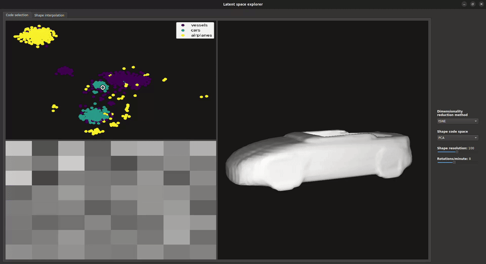

# Latent code explorer (DeepSDF)
This application enables the exploration of a learned latent space of the [DeepSDF](https://github.com/facebookresearch/DeepSDF) model proposed by *Park et al.*. For the demo, a smaller model of the proposed *DeepSDF* architecture was trained on a subset of 3 categories (vessels, cars and airplanes) from the [ShapeNetCore](https://huggingface.co/datasets/ShapeNet/ShapeNetCore) (v2) dataset, with roughly 200 shapes each.

To intuitively visualize the learned 64 dimensional latent code per shape, they are projected to a reduced dimensionality of 2. Selecting an arbitrary point in this 2D space, barycentric weights are calculated to calculate a weighted latent code, which is reconstructed to a new 3D shape. Finally, 2 latent codes can be selected and interpolated.

## Demo


## Installation

```bash
git clone https://github.com/RoelWebb/latent_space_explorer && cd latent_space_explorer
git clone https://github.com/facebookresearch/DeepSDF.git

# Download pretrained weights, model specs and split for category annotations
cd experiments && mkdir cars_vessels_airplanes && cd cars_vessels_airplanes
wget -O specs.json "https://drive.google.com/uc?export=download&id=1p6gieZuERVl9dqnqtH3ug8JG--bXlvP0"
mkdir LatentCodes && cd LatentCodes && wget -O latest.pth "https://drive.google.com/uc?export=download&id=1HZCQv6k89llQB3Iis7EbpX8zVPISjy2c" && cd ..
mkdir ModelParameters && cd ModelParameters && wget -O latest.pth "https://drive.google.com/uc?export=download&id=1G9w_H2lZQP7Z8_cBmgpxa6EouJwvG3Rq" && cd ..
cd ../..

cd splits
wget -O cars_vessels_airplanes_train.json "https://drive.google.com/uc?export=download&id=15MFd-__SyXKUjmoOrmPO_WaOPSs5liL0" && cd ..
```

```bash
# Setup venv environment and install dependencies
python3.10 -m venv .venv
source .venv/bin/activate

pip install torch==2.0.1 --index-url https://download.pytorch.org/whl/cu118
pip install tsnecuda==3.0.1+cu118 -f  https://tsnecuda.isx.ai/tsnecuda_stable.html
pip install -e .
```

## Running the application
To run the implementation, run the following command from the project directory root:
```bash
python src/latent_space_explorer/app.py
```

The application consists of a code selection tab and shape interpolation tab, both with a menu to adjust relevant parameters (shape resolution is only updated after a new code selection). The code selection tab contains the reduced dimensionality map (top-left) to select a new single latent code with a left-click and an additional latent code with right-click to enable shape interpolation in the interpolation tab by adjusting the slider. The shape code visualization (bottom-left) enables increasing or decreasing of a selected latent code element with left- or right-click respectively.

## License
Latent space explorer is released under the MIT License for its permissive open-source use and distribution, as stated in the [LICENSE file](LICENSE).

## Acknowledgement
The script [mesh_VARIATION.py](src/latent_space_explorer/utils/mesh_VARIATION.py) is a direct copy of [`deep_sdf/mesh.py`](https://github.com/facebookresearch/DeepSDF/blob/main/deep_sdf/mesh.py) from [DeepSDF](https://github.com/facebookresearch/DeepSDF) with very minor adjustments.

## Future todos
- [ ] Profile code for performance bottlenecks (try decreasing points where DeepSDF is infered and check repeated self.vao_mesh initialization in [mesh.py](src/latent_space_explorer/UI/mesh.py))
- [ ] Check correct stretching/sizing of reduced dimensionality plot for click position and draw reduced dimensionality with PyQt for higher resolution (clicking outside scatter points should not update the mesh)
- [ ] Add more pretrained neural networks such as Spaghetti
- [ ] Train model on more points per shape and more shapes for higher shape quality
